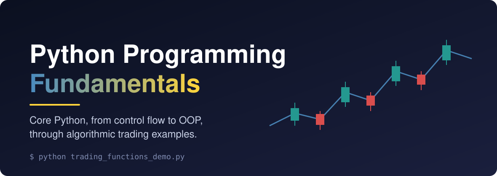
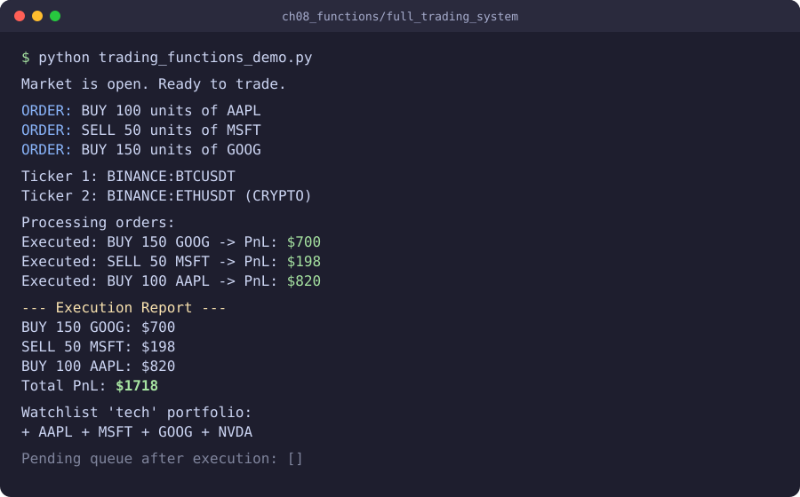

<!-- ────────────────────────────── -->
<!-- header: project logo or banner -->
<!-- ────────────────────────────── -->
<p align="center">
  <a href="https://github.com/alexalcon/python_programming_fundamentals">
    
  </a>
</p>

<!-- ───────────────────────────────────────────────────────────────── -->
<!-- header: project title, one line description, links and dev badges -->
<!-- ───────────────────────────────────────────────────────────────── -->
<h1 align="center">Python Programming Fundamentals</h1>

<div align="center">
  <p>
    Master core Python, from control flow to object-oriented design, through hands-on algorithmic trading examples.
    <br>
    <br>
    <!-- project informational links and badges -->
    <a href="https://github.com/alexalcon/python_programming_fundamentals/issues/new?assignees=&labels=bug&template=01_BUG_REPORT.md&title=bug%3A+">Report a Bug</a>
    ·
    <a href="https://github.com/alexalcon/python_programming_fundamentals/issues/new?assignees=&labels=enhancement&template=02_FEATURE_REQUEST.md&title=feat%3A+">Request a Feature</a>
    ·
    <a href="https://github.com/alexalcon/python_programming_fundamentals/issues/new?assignees=&labels=question&template=04_SUPPORT_QUESTION.md&title=support%3A+">Ask a Question</a>
  </p>

  [](LICENSE)
  [](https://github.com/alexalcon/python_programming_fundamentals/issues?q=is%3Aissue+is%3Aopen+label%3A%22help+wanted%22)
</div>

<br>

<!-- ────────────────────── -->
<!-- header: feature badges -->
<!-- ────────────────────── -->
<div align="center">

  [](https://docs.python.org/3/)
  [](https://docs.python.org/3/library/index.html)
  [](#about)

  [](./structured_programming)&nbsp;
  [](./books_code/python_crash_course_book/ch08_functions)&nbsp;
  [](./books_code/python_crash_course_book/ch09_classes)&nbsp;
  [](#about)

</div>

<!-- ──────────────────────────────────────── -->
<!-- header: detailed synopsis of the project -->
<!-- ──────────────────────────────────────── -->
<div align="center">
  <p align="center">
  <strong>Python Programming Fundamentals</strong> is a personal learning repository that builds Python skills step by step, from the first loop to multi-module programs, with every concept anchored in the world of algorithmic trading.
  </p>
  <p align="center">
  It brings together three complementary tracks: book exercises from <a href="https://www.oreilly.com/library/view/python-crash-course/9781098156664/"><em>Python Crash Course (3rd Edition)</em></a> (lists, dictionaries, functions, classes, files and exceptions), structured programming drills (numerical sequences, nested control flow and 2D matrix patterns), and standalone concept demos. Every script runs on its own with nothing more than the Python standard library.
  </p>
  <p align="center">
  Instead of generic examples, orders, tickers, strategies, risk managers and portfolios are the vocabulary of every exercise. The goal is simple: the fundamentals learned here should transfer directly to real quantitative trading work.
  </p>
</div>

<!-- ─────────────────────────────────────────────────── -->
<!-- header: screenshot that shows how the project works -->
<!-- ─────────────────────────────────────────────────── -->
<div align="center">
  <a>
    
  </a>
</div>

<!-- ───────────────────────── -->
<!-- header: table of contents -->
<!-- ───────────────────────── -->
## Table of Contents
<!-- body -->
- [About](#about)
  - [Built With](#built-with)
- [Getting Started](#getting-started)
  - [Prerequisites](#prerequisites)
  - [Installation](#installation)
  - [Usage](#usage)
- [Roadmap](#roadmap)
- [Support](#support)
- [Project assistance](#project-assistance)
<!-- footer -->
- [Contributing](#contributing)
- [Authors & contributors](#authors--contributors)
- [Security](#security)
- [License](#license)
- [Acknowledgements](#acknowledgements)

---

<!-- ─────────────────────────────────────────── -->
<!-- body and footer: table of contents sections -->
<!-- ─────────────────────────────────────────── -->

## About

Python has become the dominant language of quantitative finance. Research notebooks, backtesting engines, execution bots and risk dashboards are routinely written in it, and every one of those systems ultimately rests on the same foundation: variables, control flow, data structures, functions and classes used correctly. This repository is a deliberate, hands-on path through that foundation, written by someone whose destination is algorithmic trading.

The problem is that the two worlds rarely meet at the beginner level. Most introductory Python material teaches through generic, disconnected examples (shopping lists, pets, pizzas), while most algorithmic trading resources assume the reader is already fluent in the language. A learner heading toward quantitative trading is therefore left without a bridge: the fundamentals feel abstract, and the trading material feels out of reach. Concretely, what is missing is a single, structured body of exercises in which core Python concepts are practised directly through trading-domain problems.

The general objective of this project is to develop a structured collection of Python exercises for mastering programming fundamentals in the context of algorithmic trading. To reach it, the project sets out to: implement structured programming exercises covering numerical sequences, nested control flow and 2D matrix patterns; program the exercises of each book chapter using trading-domain examples such as orders, tickers and watchlists; define object-oriented models for trading strategies, risk management and portfolios; and build multi-module trading system demos that combine the concepts of each chapter into a working whole.

The effort is justified first by its audience: the author, and any other beginner who wants to reach quantitative trading with a solid programming base rather than copied snippets. It also applies concrete knowledge instead of just listing topics: counter- and sentinel-controlled iteration, list and dictionary manipulation, positional and keyword arguments with `*args` and `**kwargs`, module imports, class and instance attributes, inheritance, composition, class methods with `cls`, file I/O with JSON persistence and exception handling.

The project has clear limits. It is strictly educational and is **not** production trading code: there is no live market data, no broker or exchange API, no real order execution and no financial advice. Prices and P&L figures are illustrative, and the code deliberately stays within the Python standard library so that the language itself, not third-party frameworks, remains the focus. Within those limits, the project has so far produced standalone scripts from <a href="https://www.oreilly.com/library/view/python-crash-course/9781098156664/"><em>Python Crash Course (3rd Edition)</em></a> book's exercises, covering chapters 3, 4, 6, 8, 9 and 10 (including full trading system demos for chapters 8, 9 and 10).

<!-- ──────────────────────────────────────────────────────────────────────────── -->
<!-- The sections below (Built With to Usage) are intentionally left for the      -->
<!-- maintainer to fill in, according to their own creativity and conventions.    -->
<!-- ──────────────────────────────────────────────────────────────────────────── -->

### Built With

- **Python 3** - the primary language used across all exercises, demos and mini-projects.
- **Python Standard Library** - the repository is intentionally built around stdlib-only modules, including `random` for simulated trading behavior, `pathlib` for file handling, `json` for persistence examples and `math` for numerical exercises.
- **Object-Oriented Python** - class-based examples model trading strategies, portfolios and risk-management components in the Chapter 9 materials.

## Getting Started

### Prerequisites

Before running the exercises in this repository, make sure you have:

- **Python 3** installed and available in your terminal.
  - You can also setup and activate a virtual environment to manage dependencies and isolate the project. A conda environment is used for this project though, and it is recommended to activate it before running any scripts, especially if you have multiple Python versions installed.
- **Git** installed if you want to clone the repository locally.
- A code editor or IDE such as **VS Code** for browsing and running the scripts more comfortably.

This project uses the **Python standard library only** for its core learning materials, so there are no required third-party packages to install.

### Installation

1. Clone the repository:

```bash
git clone https://github.com/alexalcon/python_programming_fundamentals.git
```

2. Move into the project folder:

```bash
cd python_programming_fundamentals
```

3. Verify that Python 3 is available (according to the prefered development environment setup configuration, whether using a local installation or your activated environment):

```bash
conda activate <your-environment-name>
python --version
```

## Usage

Start running any standalone script directly. For example:

```bash
python3 books_code/python_crash_course_book/ch03_introducing_lists/trading_lists_demo.py
```

Most scripts in this repository can be run directly from the project root with `python3 <path-to-script>.py`.

The main exception is the Chapter 8 multi-file demo, which should be run from inside its own folder so the local import resolves correctly:

```bash
cd books_code/python_crash_course_book/ch08_functions/full_trading_system
python3 trading_functions_demo.py
```

<div style="
    padding: 12px 16px;
    border-left: 5px solid #2f80ed;
    background-color: #eef6ff;
    border-radius: 6px;
    margin: 12px 0;
">
    <strong>Note:</strong> Although this repository mainly uses the Python standard library, it is still recommended to run the code inside a proper virtual environment or Conda environment to keep your Python setup isolated, avoid package conflicts, and maintain a clean workspace while learning and experimenting. Thus run the python scripts using the activated environment.
</div>

## Roadmap

See the [open issues](https://github.com/alexalcon/python_programming_fundamentals/issues) for a list of proposed features (and known issues).

- [Top Feature Requests](https://github.com/alexalcon/python_programming_fundamentals/issues?q=label%3Aenhancement+is%3Aopen+sort%3Areactions-%2B1-desc) (Add your votes using the 👍 reaction)
- [Top Bugs](https://github.com/alexalcon/python_programming_fundamentals/issues?q=is%3Aissue+is%3Aopen+label%3Abug+sort%3Areactions-%2B1-desc) (Add your votes using the 👍 reaction)
- [Newest Bugs](https://github.com/alexalcon/python_programming_fundamentals/issues?q=is%3Aopen+is%3Aissue+label%3Abug)

## Support

Reach out to the maintainer at one of the following places:

- [GitHub issues](https://github.com/alexalcon/python_programming_fundamentals/issues/new?assignees=&labels=question&template=04_SUPPORT_QUESTION.md&title=support%3A+)
- Contact options listed on [this GitHub profile](https://github.com/alexalcon)

## Project assistance

If you want to say **thank you** or/and support active development of Python Programming Fundamentals:

- Add a [GitHub Star](https://github.com/alexalcon/python_programming_fundamentals) to the project.
- Tweet about Python Programming Fundamentals.
- Write interesting articles about the project on [Dev.to](https://dev.to/), [Medium](https://medium.com/) or your personal blog.

Together, we can make Python Programming Fundamentals **better**!

<!-- ────────────────── -->
<!-- footer subsections -->
<!-- ────────────────── -->

## Contributing

First off, thanks for taking the time to contribute! Contributions are what make the open-source community such an amazing place to learn, inspire, and create. Any contributions you make will benefit everybody else and are **greatly appreciated**.

Please read [the contribution guidelines](.github/CONTRIBUTING.md), and thank you for being involved!

## Authors & contributors

The original setup of this repository is by [Alex Alcon](https://github.com/alexalcon).

For a full list of all authors and contributors, see [the contributors page](https://github.com/alexalcon/python_programming_fundamentals/contributors).

## Security

Python Programming Fundamentals follows good practices of security, but 100% security cannot be assured.
Python Programming Fundamentals is provided **"as is"** without any **warranty**. Use at your own risk.

_For more information and to report security issues, please refer to our [security documentation](.github/SECURITY.md)._

## License

This project is licensed under the **MIT license**.

See [LICENSE](LICENSE) for more information.

## Acknowledgements

The Python code knowledge was primarily gained and structured from the following resources:

- **Eric Matthes**, author of [*Python Crash Course (3rd Edition)*](https://www.oreilly.com/library/view/python-crash-course/9781098156664/), whose chapter structure shapes the `books_code/python_crash_course_book/` track of this repository.